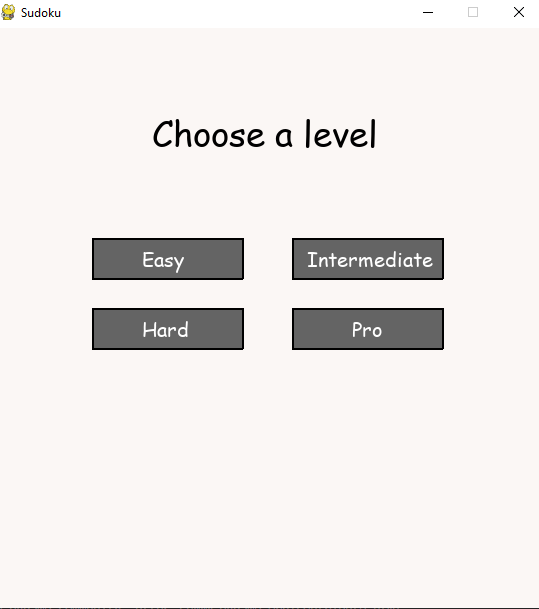
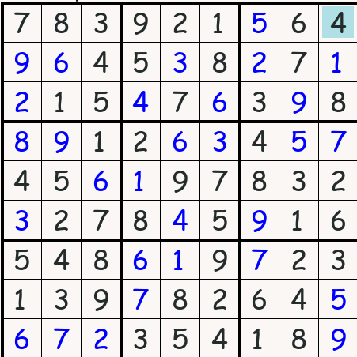
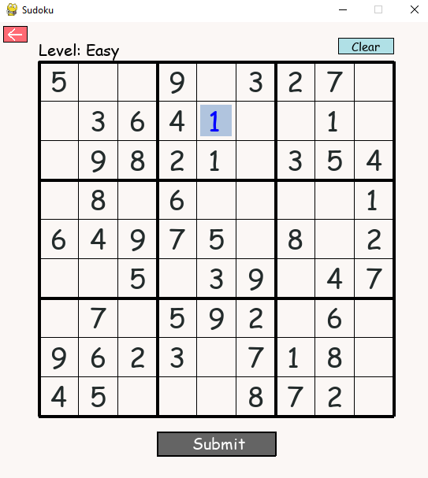
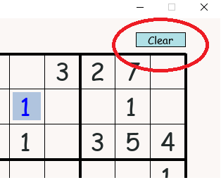
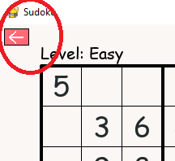
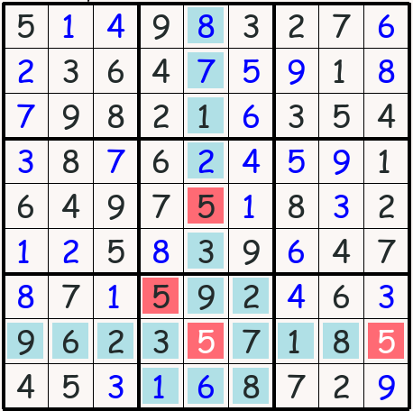
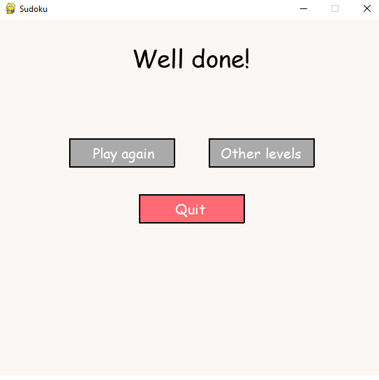

# SUDOKU
#### Video Demo:  <https://www.youtube.com/watch?v=xFzKyzZu-0k>
#### Description:
This is a simple Sudoku game written by Python.
 
1. First, run the command line:
> python3 project.py
2. A window screen will appear:
 
 
<picture>
    
</picture>
 
 
3. After choosing a level, game starts, your work is to complete all the missing numbers in the puzzle. In case you don't know the rule yet, Sudoku is played on a grid of 9 x 9 spaces. Within the rows and columns are 9 “squares” (made up of 3 x 3 spaces). Each row, column and square (9 spaces each) needs to be filled out with the numbers 1-9, without repeating any numbers within the row, column or square.
 
For example, this is a right puzzle
 
 
<picture>
    
</picture>
 
 
4. So how to fill an empty space, or change the number, or clear it?
 
You can hover your mouse to the space you want to modify, left click, then type the number you think is right (from 1 to 9) (in case you want to clear that space, press Backspace). Then press Enter (or Esc, or left click again), now you're free to move to other spaces. 
 
Another way is using arrow keys in your keyboard (left, right, up, down) to move to the space you want to change, again press Enter then type the number, then press Enter again (or Esc).
 
 
<picture>
    
</picture>
 
 
5. If you want to clear all filled spaces, just click on the Clear button
 
 
<picture>
    
</picture>
 
 
6. If you think the level you're playing is boring, you can go back and choose another level
 
 
<picture>
    
</picture>
 
 
7. Once you've completed the puzzle, click the Submit button. If your answer is wrong, the board will behave like this:
 
 
<picture>
    
</picture>
 
 
As you see, all the rows, columns, squares have repeated numbers are highlighted.
 
 
Or else, you can choose to play at that level again, or another level, or quit the game.
 
 
<picture>
    
</picture>
 
 
 
#### Files:
1. project.py
 
This file is the main file of the program
2. test_project.py
 
This file runs tests of functions (in *project.py*) that check the validity of a sudoku puzzle
3. sudoku.py
 
This file creates sudoku puzzles for the sake of main file (*project.py*)